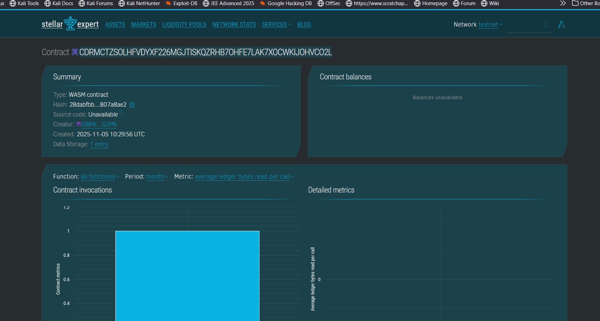

# Digital Identity Verification

## Project Description

Digital Identity Verification is a blockchain-based smart contract solution built on the Stellar network using Soroban SDK. This project provides a decentralized identity management system that enables users to register their digital identities on-chain and have them verified by authorized administrators. The system eliminates the need for centralized identity databases while ensuring transparency, immutability, and user privacy through blockchain technology.

The smart contract allows individuals to create verifiable digital identities that can be used across various decentralized applications and services, providing a foundation for trustless identity verification in the Web3 ecosystem.

## Project Vision

Our vision is to revolutionize digital identity management by creating a decentralized, secure, and user-controlled identity verification system. We aim to:

- **Empower Users**: Give individuals complete ownership and control over their digital identities without relying on centralized authorities
- **Enhance Security**: Leverage blockchain's immutability to prevent identity fraud and unauthorized modifications
- **Enable Interoperability**: Create a universal identity layer that can be integrated across multiple blockchain applications and services
- **Promote Privacy**: Allow users to verify their identity without exposing unnecessary personal information
- **Build Trust**: Establish a transparent verification system where identity credentials can be independently verified on-chain

By democratizing identity verification, we envision a future where digital identities are portable, secure, and universally recognized across the decentralized web.

## Key Features

### 1. **User Identity Registration**
- Self-sovereign identity creation where users register their own identities
- Store essential identity information (full name, ID number) on-chain
- Timestamp-based registration tracking for audit trails
- Duplicate registration prevention to ensure one identity per address

### 2. **Administrative Verification**
- Authorized verifiers can approve registered identities
- Two-step verification process (registration + verification) for enhanced security
- Verification timestamps for compliance and tracking purposes
- Prevention of double verification to maintain data integrity

### 3. **Identity Retrieval**
- Public query function to view identity details
- Transparent verification status checking
- Address-based identity lookup system
- Graceful handling of non-existent identities

### 4. **Statistical Tracking**
- Real-time count of total registered identities
- Analytics support for system monitoring and growth tracking
- Transparent metrics accessible to all network participants

### 5. **Security & Privacy**
- Address-based authentication using Stellar's `require_auth()`
- Immutable identity records protected by blockchain consensus
- Extended storage TTL (5000 ledgers) for data persistence
- User-controlled data with blockchain-level security

## Future Scope

### Short-term Enhancements (3-6 months)
- **Multi-factor Verification**: Implement different verification levels (basic, advanced, premium)
- **Document Attachment**: Support for encrypted document hashes (passport, driver's license, etc.)
- **Identity Revocation**: Allow users or admins to revoke compromised identities
- **Verification Expiry**: Time-bound verifications requiring periodic renewal

### Medium-term Developments (6-12 months)
- **Reputation System**: Score-based identity reputation tracking based on interactions
- **Decentralized Verifiers**: Multi-signature verification from multiple independent verifiers
- **Selective Disclosure**: Zero-knowledge proofs for sharing specific identity attributes
- **Cross-chain Integration**: Bridge identities to other blockchain networks (Ethereum, Polygon)

### Long-term Vision (1-2 years)
- **DID Standards Compliance**: Implement W3C Decentralized Identifiers (DID) standards
- **Verifiable Credentials**: Issue and verify cryptographic credentials tied to identities
- **Biometric Integration**: Support for biometric hash storage (fingerprint, facial recognition)
- **DAO Governance**: Community-driven governance for verification standards and policies
- **Identity Recovery**: Social recovery mechanisms for lost access
- **Mobile SDK**: Native mobile applications for easy identity management
- **Enterprise Integration**: API layer for businesses to integrate identity verification
- **Compliance Framework**: KYC/AML integration while maintaining privacy

### Potential Use Cases
- **DeFi Platforms**: KYC-compliant decentralized finance applications
- **Healthcare**: Secure patient identity management across providers
- **Education**: Verifiable academic credentials and certificates
- **Supply Chain**: Verified supplier and manufacturer identities
- **Voting Systems**: Blockchain-based voting with identity verification
- **Access Control**: Decentralized authentication for Web3 applications

---

## Getting Started

### Prerequisites
- Stellar account and wallet
- Soroban CLI installed
- Basic understanding of Rust and Soroban SDK

### Installation & Deployment
```bash
# Clone the repository
git clone <repository-url>

# Build the contract
soroban contract build

# Deploy to Stellar network
soroban contract deploy \
  --wasm target/wasm32-unknown-unknown/release/digital_identity.wasm \
  --network testnet
```

### Usage Examples
```bash
# Register an identity
soroban contract invoke \
  --id <CONTRACT_ID> \
  --network testnet \
  -- register_identity \
  --user <USER_ADDRESS> \
  --full_name "John Doe" \
  --id_number "ID123456"

# Verify an identity (admin only)
soroban contract invoke \
  --id <CONTRACT_ID> \
  --network testnet \
  -- verify_identity \
  --admin <ADMIN_ADDRESS> \
  --user_address <USER_ADDRESS>

# View identity details
soroban contract invoke \
  --id <CONTRACT_ID> \
  --network testnet \
  -- view_identity \
  --user_address <USER_ADDRESS>
```

## Contract Details
Contract ID: CDRMCTZSOLHFVDYXF226MGJTISKQZRHB7OHFE7LAK7XOCWKIJOHVCO2L

